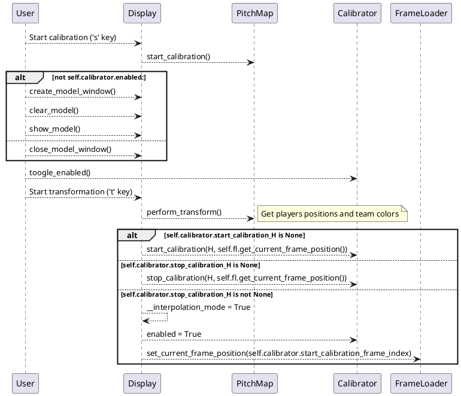

```plantuml
!includeurl https://raw.githubusercontent.com/karlosos/RedDress-PlantUML/master/light_theme.puml

@startuml
User --> Display: Start calibration ('s' key)
Display --> PitchMap: start_calibration()

alt not self.calibrator.enabled:
    User --> Display: create_model_window()
    User --> Display: clear_model()
    User --> Display: show_model()
else 
    User --> Display: close_model_window()
end

User --> Calibrator: toogle_enabled()

User --> Display: Start transformation ('t' key)
Display --> PitchMap: perform_transform()

note right
    Get players positions and team colors
end note

alt self.calibrator.start_calibration_H is None
    Display --> Calibrator: start_calibration(H, self.fl.get_current_frame_position())
else self.calibrator.stop_calibration_H is None
    Display --> Calibrator: stop_calibration(H, self.fl.get_current_frame_position())
else self.calibrator.stop_calibration_H is not None
    Display --> Display: __interpolation_mode = True
    Display --> Calibrator: enabled = True
    Display --> FrameLoader: set_current_frame_position(self.calibrator.start_calibration_frame_index)
end
@enduml
```