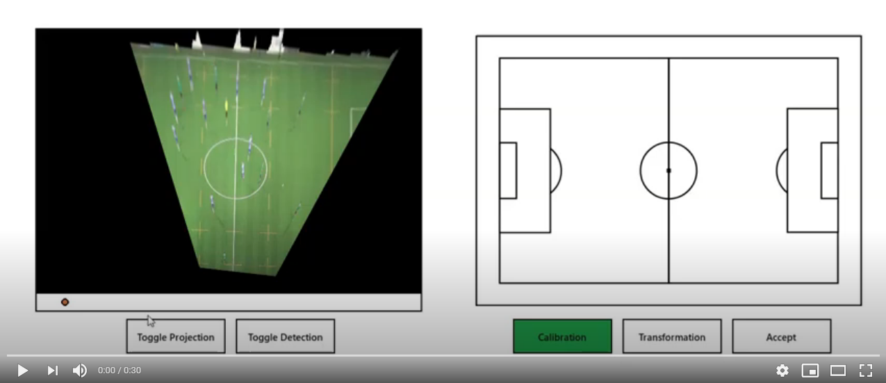
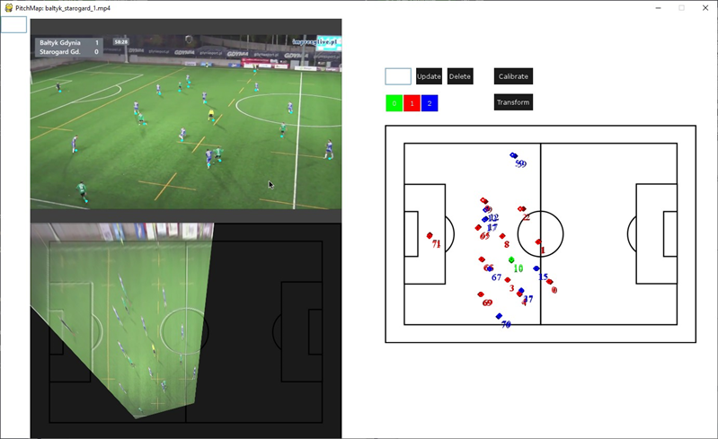
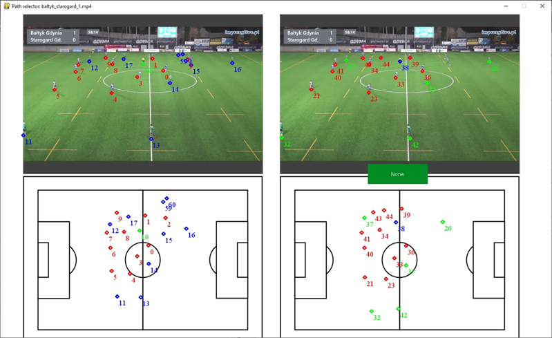
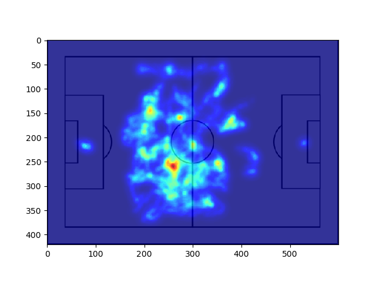

# Demos 🖥️

Check short video of system in action on YouTube:

## Other apps

Project consists of few separated apps. The main one is named **PitchMap** which performs entire process of camera calibration, players detection, players classification and projecting positions to the 2d map. **Annotator** is a program for manual calibration and players annotation for evaluation purposes. **Comparator** is an app for comparing different approaches with real data gatherem with annotator. We've also created simple script **Heatmap** for generating heatmaps.

### Annotator

### Comparator

### Heatmap

<!-- ## Trajectory analysis -->