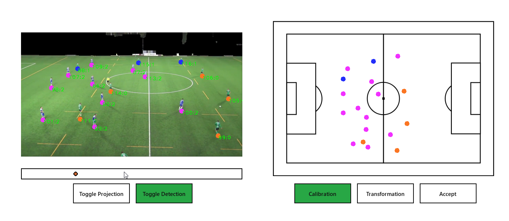
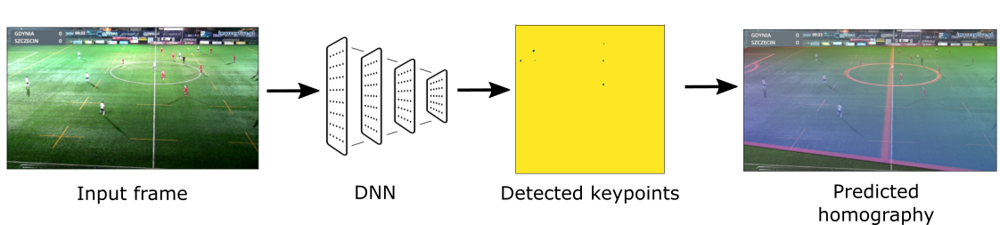
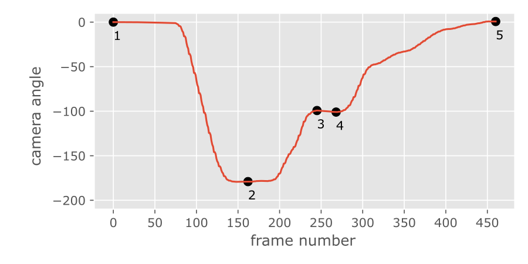
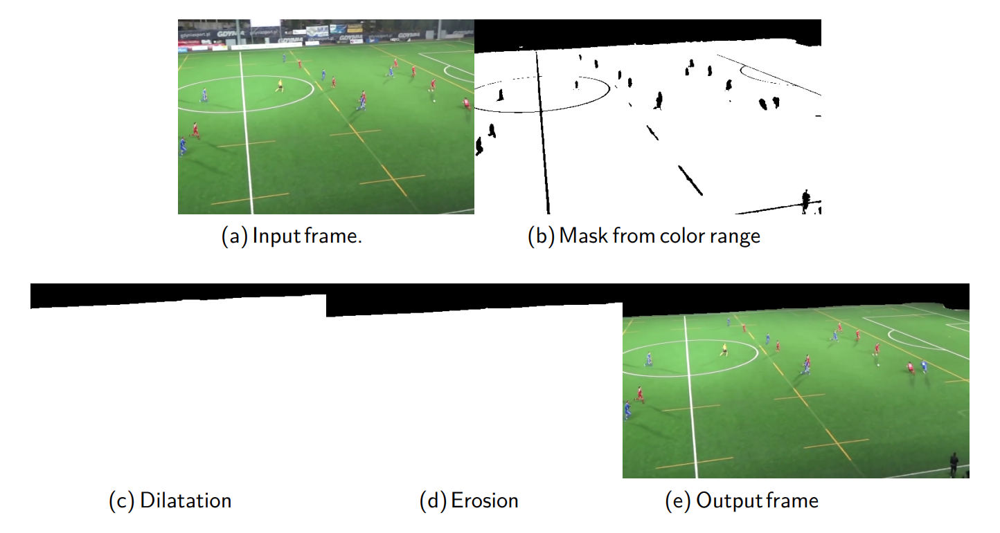
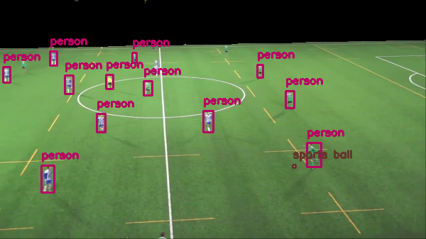
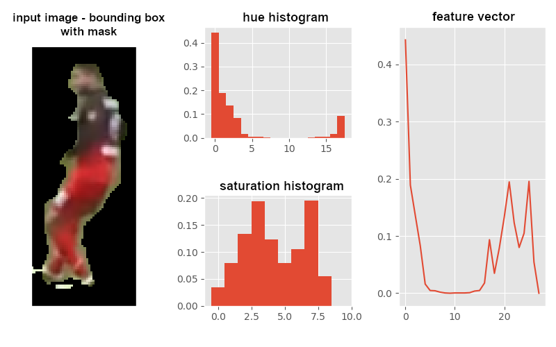
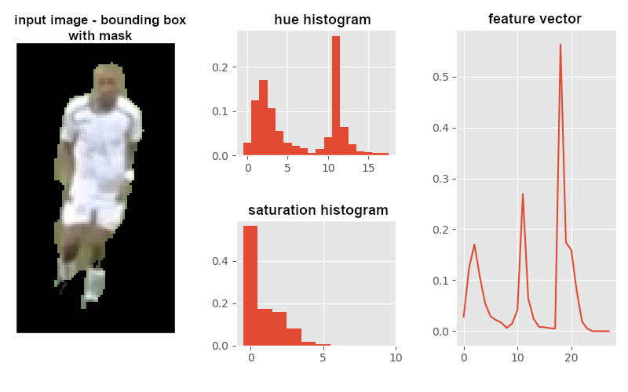
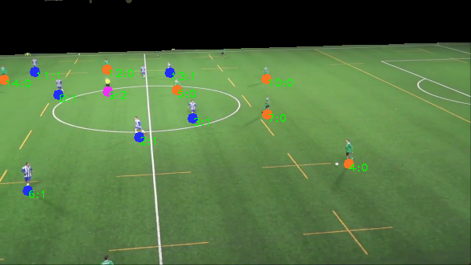

# Introduction ⚡

This is a research project of tracking football players on the playfield captured by a moving camera. Main objective of **automatic camera calibration** was achieved with available solutions (libraries and other projects).

:::caution
This project is research only proof of concept. 
We do not suggest trying to use this code as it is poorly mantained.
:::

## Automatic calibration 

Automatic camera calibration module was developed using [Segmentation Models](https://github.com/qubvel/segmentation_models) based on [DonsetPG/narya](https://github.com/DonsetPG/narya). It uses *EfficentNetb3* and *FeautrePyramidNetwork*. **Notebooks and scripts of camera calibration model are available in [karlosos/camera_calib](https://github.com/karlosos/camera_calib) repository.**

:::info
If you are interested about sports camera calibration we can recommend [Awesome Sports Camera Calibration](https://github.com/cemunds/awesome-sports-camera-calibration) on GitHub.
:::

Training data was acquired using [kkoripl/NaryaKeyPointsDatasetCreator](https://github.com/kkoripl/NaryaKeyPointsDatasetCreator). We've collected 427 training images from 7 matches played on 3 stadiums.

:::note
Described model cannot succesfully detect homography in middle sections of the pitch. This is because of not enough characteristic points in this area. That's why **camera movement analysis** is required for calibrating all frames in input videos.
:::

## Camera movement analysis

**Camera movement analysis is required step for finding homography for each frame in input video.** Camera movement modeling was done using dense optical flow which is calculated on the startup of the application.

With camera movement model we can better interpolate homographies in comparison to naive approach of linear interpolation between calibrated frames in time. **Interpolation is performed in camera angle domain**.

Optical flow is calculated only for non pitch area which is found using color ranges.

:::note
We calculate optical flow only for non pitch area by color ranges. Because of that our system cannot be used in situations where non pitch area is not distinguished by color, e.g. futsal, on stadiums without stands, etc.
:::

## Players detection

Players detection is achieved with Yolo model available in [cvlib](https://www.cvlib.net/). We only use objects with `person` label.

Each player is classified into 5 classes: team A, team B, goalkeepers and a referee using HSV histograms. Each player is horizontaly divided into halves. Upper halve represents color of the t-shirt, lower halve represents color of the shorts. 

